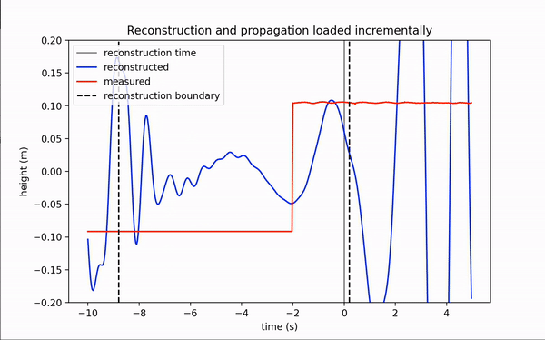
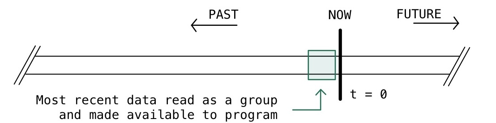
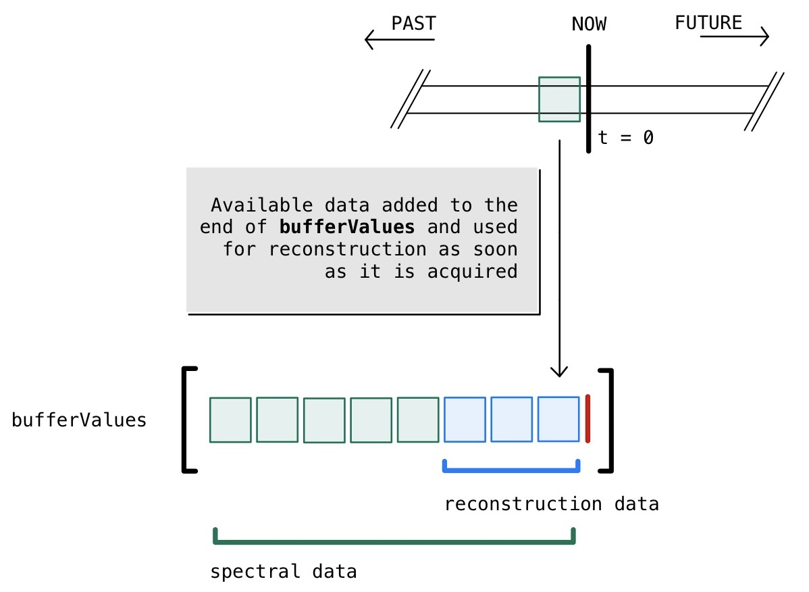
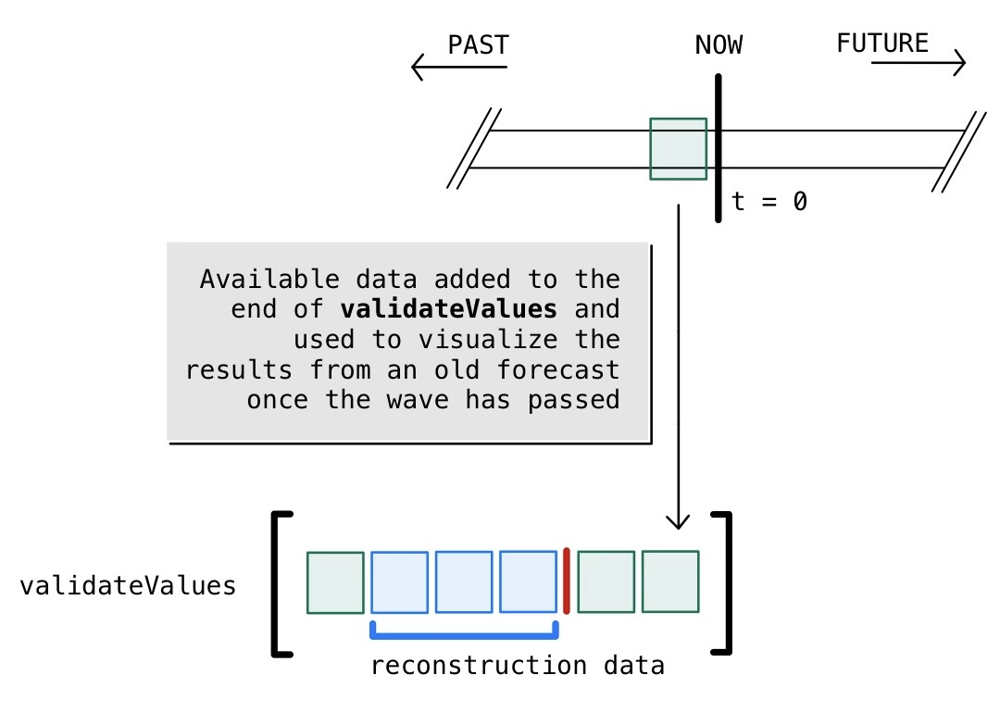
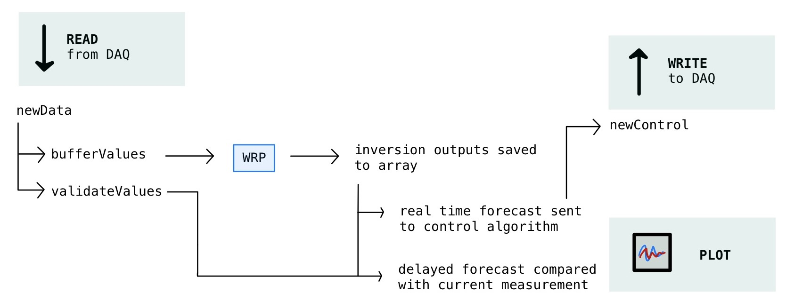

.. py-wrp documentation master file, created by
   sphinx-quickstart on Fri Jun 17 08:55:55 2022.
   You can adapt this file completely to your liking, but it should at least
   contain the root `toctree` directive.

An open source wave reconstruction and propagation library
==========================================================

.. toctree::
   reference
   theory

Overview
--------
To see the math behind the code, please visit :doc:`theory`.

This code was developed to imitate the style of data acquisition through a National Instruments DAQ_. Data is handed in chunks to the PC whenever a certain number of samples accumulates in the `hardware` buffer. This corresponds to a certain amount of time depending on the sampling frequency. 

.. _DAQ: http://www.ni.com/en-us/shop/pxi.html

When this collection of samples is given to the PC, it is used to update multiple `local` buffers. The first buffer of interest is an array with the name `bufferValues`. The new data is added to the end of the array, while the oldest values are removed. This buffer holds the data which will later be used for real time reconstruction and assimilation.

A second buffer is maintained locally to validate the previous reconstructions called `validateValues`. Wave predictions of course are made for the future, and can't be validated until this future scenario plays out. However, the active control system requires the future wave shape to be available immediately. This is the motivation for a second local buffer which is updated in the same way as the former when new data is available. 

   
A visualization of the ovarching processes happening on the PC.

Here we visualize the complete system with which we work.

Indices and tables
==================

* :ref:`genindex`
* :ref:`modindex`
* :ref:`search`
